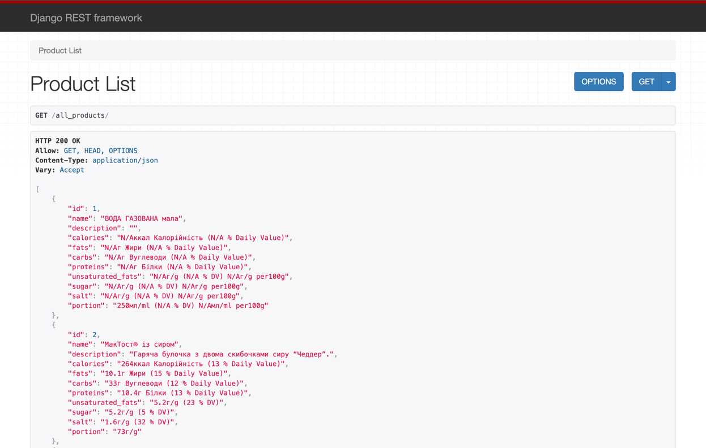

# mcdonalds Project

I have developed a parser that extracts data and stores it in JSON files under "all_Items". After I built a Django application where I established a database and migrated the data from JSON file. Additionally, I implemented the three specified endpoints as required. To enhance user experience, I integrated `Swagger` for smoother navigation and usage. Below is a screenshot showcasing these endpoints.

Additionally, I included the endpoint output using the `Django Debug Toolbar`. Here's how it appears in the screenshot.

The `secure.ini` file wasn't intentionally added to the ignore list to allow for its visibility.